# 🚨 SAFE Route

An intelligent evacuation route planning system using **A* pathfinding algorithm** and **fuzzy logic** to determine optimal evacuation paths in Leon, Iloilo, Philippines.


## 📋 Table of Contents

- [Overview](#overview)
- [Features](#features)
- [System Architecture](#system-architecture)
- [Installation](#installation)
- [Usage](#usage)
- [Data Requirements](#data-requirements)
- [Algorithm Details](#algorithm-details)
- [Screenshots](#screenshots)
- [Requirements](#requirements)
- [Contributing](#contributing)
- [License](#license)

## 🌟 Overview

The SAFE Route (Smart Alert and Fast Evacuation with Rerouting Technology) is a web-based application designed to help emergency responders and local government units plan optimal evacuation routes during disasters. The system combines advanced pathfinding algorithms with real-world road conditions to recommend the safest and most efficient evacuation paths.

### Key Technologies

- **A* Pathfinding Algorithm**: Finds optimal routes using heuristic search
- **Fuzzy Logic**: Evaluates road conditions (slope, travel time, curvature)
- **Interactive Mapping**: Satellite imagery with route visualization
- **Real-time Calculation**: Instant path computation and visualization

## ✨ Features

### 🗺️ Interactive Map Visualization
- Satellite imagery powered by Esri
- Visual markers for all barangays (villages)
- Color-coded path highlighting (gray for alternatives, red for optimal)
- Interactive selection and navigation

### 🧠 Intelligent Pathfinding
- **A* Algorithm** with priority queue optimization
- **g(n)**: Actual cost from start using fuzzy logic
- **h(n)**: Heuristic based on Haversine distance
- **f(n)**: Combined cost for optimal path selection

### 📊 Fuzzy Logic Evaluation
Evaluates road segments based on:
- **Slope**: Low (-10 to 0°), Medium (-2 to 2°), High (0 to 10°)
- **Travel Time**: Fast (0-10 min), Average (5-25 min), Slow (20-30 min)
- **Curvature**: Low (0-0.5), Medium (0.2-0.8), High (0.5-1)

### 📈 Results Dashboard
- Distance in kilometers
- Travel time in minutes
- Cost metrics
- Alternative route options

## 🏗️ System Architecture

```mermaid
flowchart LR
    Start([Start Application]) --> LoadData[Load KML & Excel Files]
    LoadData --> BuildGraph[Build Graph Structure<br/>Connect Barangays]
    BuildGraph --> ShowMap[Display Map with<br/>All Barangays]
    ShowMap --> UserSelect{User Selects<br/>Barangay?}
    UserSelect -->|No| ShowMap
    UserSelect -->|Yes| AStar[Run A* Algorithm<br/>Find Best Path]
    AStar --> Fuzzy[Calculate Costs Using<br/>Fuzzy Logic]
    Fuzzy --> CalcPath[Calculate:<br/>g-cost + h-cost = f-cost]
    CalcPath --> FindBest[Find Path with<br/>Minimum Cost]
    FindBest --> Display[Display Results:<br/>Distance, Time, Cost]
    Display --> Highlight[Highlight Best Path<br/>on Map in Red]
    Highlight --> Done{Select Another<br/>Barangay?}
    Done -->|Yes| AStar
    Done -->|No| End([End])
```



## 🚀 Installation

### Prerequisites

- Python 3.8 or higher
- pip (Python package manager)
- Internet connection (for map tiles)

### Step 1: Clone the Repository

```bash
git clone https://github.com/yourusername/leon-evacuation-system.git
cd leon-evacuation-system
```

### Step 2: Install Dependencies

```bash
pip install -r requirements.txt
```

Or install manually:

```bash
pip install streamlit folium streamlit-folium numpy scikit-fuzzy pandas openpyxl
```

### Step 3: Prepare Data Files

Create a `data/` folder in the project root and add your files:

```
leon-evacuation-system/
├── evacuation_system_astar.py
├── requirements.txt
├── README.md
└── data/
    ├── completeroad.kml
    ├── Poblacion_to_Bacolod.xlsx
    ├── Poblacion_to_Bobon.xlsx
    ├── Poblacion_to_Binolbog.xlsx
    ├── Poblacion_to_Barangbang.xlsx
    ├── Poblacion_to_Carolina.xlsx
    ├── Poblacion_to_Gines.xlsx
    ├── Poblacion_to_Ingay.xlsx
    └── Poblacion_to_Lonoc.xlsx
```

### Step 4: Run the Application

```bash
streamlit run evacuation_system_astar.py
```

The application will open in your default web browser at `http://localhost:8501`

## 📖 Usage

### Basic Workflow

1. **Launch the application** using the command above
2. **View the map** showing all barangays in Leon
3. **Select a barangay** from the dropdown menu
4. **View the optimal route** highlighted in red on the map
5. **Check the metrics**: distance, travel time, and cost
6. **Select another barangay** to compare routes

### Navigation

- **Zoom**: Use mouse wheel or +/- buttons
- **Pan**: Click and drag the map
- **Select**: Use the dropdown in the sidebar

## 📁 Data Requirements

### KML File Format

The KML file should contain:
- Placemark elements with route names
- LineString geometry with coordinates
- Format: `longitude,latitude,altitude`

Example structure:
```xml
<Placemark>
  <name>Poblacion to Bacolod</name>
  <LineString>
    <coordinates>
      122.3837,10.7848,0
      122.3069,10.8771,0
    </coordinates>
  </LineString>
</Placemark>
```

### Excel File Format

Each Excel file should contain:
- **Slope** column: Road gradient in degrees
- **Travel_Time_min** column: Travel time in minutes

File naming: `Poblacion_to_[BarangayName].xlsx`

## 🧮 Algorithm Details

### A* Pathfinding

The A* algorithm finds the optimal path using:

**Cost Function**: `f(n) = g(n) + h(n)`

- **g(n)**: Actual cost from start to node n (fuzzy logic evaluation)
- **h(n)**: Heuristic estimate from n to goal (Haversine distance)
- **f(n)**: Total estimated cost

**Priority Queue**: Explores nodes with lowest f(n) first

### Fuzzy Logic Evaluation

**Membership Functions**:
- Triangular membership for slope, time, and curvature
- Fuzzy rules combine conditions (AND/OR operations)
- Defuzzification produces final cost value

**Fuzzy Rules**:
- IF slope is LOW AND time is FAST AND curvature is LOW THEN cost is LOW
- IF slope is MEDIUM OR time is AVERAGE OR curvature is MEDIUM THEN cost is MEDIUM
- IF slope is HIGH OR time is SLOW OR curvature is HIGH THEN cost is HIGH

### Haversine Distance

Calculates great-circle distance between GPS coordinates:

```python
distance = 2 * R * arcsin(sqrt(sin²(Δlat/2) + cos(lat1) * cos(lat2) * sin²(Δlon/2)))
```

Where R = 6371 km (Earth's radius)

## 📸 Screenshots

### Main Interface
*Interactive map showing all barangays and evacuation center*

### Route Selection
*Selected barangay with optimal path highlighted in red*

### Results Dashboard
*Detailed metrics including distance, time, and alternative paths*

## ⚙️ Requirements

### Hardware
- **Minimum**: Intel Core i3, 4GB RAM, 500MB storage
- **Recommended**: Intel Core i5, 8GB RAM, 1GB storage

### Software
- **OS**: Windows 10+, macOS 10.14+, Ubuntu 18.04+
- **Python**: 3.8 or higher
- **Browser**: Chrome 90+, Firefox 88+, Safari 14+, Edge 90+

### Python Libraries

```
streamlit >= 1.28.0
folium >= 0.14.0
streamlit-folium >= 0.13.0
numpy >= 1.24.0
scikit-fuzzy >= 0.4.2
pandas >= 2.0.0
openpyxl >= 3.1.0
```

### Network
- Internet connection required for map tiles
- Minimum: 1 Mbps
- Recommended: 5 Mbps

## 🧪 Testing

Run the application and verify:
- ✅ Data files load successfully
- ✅ Map displays all barangays
- ✅ Barangay selection triggers route calculation
- ✅ Optimal path is highlighted in red
- ✅ Metrics display correctly

## 🚢 Deployment

### Streamlit Cloud (Free)

1. Push code to GitHub
2. Sign up at [share.streamlit.io](https://share.streamlit.io)
3. Connect your repository
4. Deploy with one click

### Docker

```dockerfile
FROM python:3.9-slim
WORKDIR /app
COPY requirements.txt .
RUN pip install -r requirements.txt
COPY . .
EXPOSE 8501
CMD ["streamlit", "run", "evacuation_system_astar.py"]
```

Build and run:
```bash
docker build -t leon-evacuation .
docker run -p 8501:8501 leon-evacuation
```

## 🤝 Contributing

Contributions are welcome! Please follow these steps:

1. Fork the repository
2. Create a feature branch (`git checkout -b feature/AmazingFeature`)
3. Commit your changes (`git commit -m 'Add some AmazingFeature'`)
4. Push to the branch (`git push origin feature/AmazingFeature`)
5. Open a Pull Request

### Development Guidelines
- Follow PEP 8 style guide
- Add docstrings to functions
- Test thoroughly before submitting
- Update documentation as needed

## 📄 License

This project is licensed under the MIT License - see the [LICENSE](LICENSE) file for details.

## 👥 Authors

- **Your Name** - *Initial work* - [YourGitHub](https://github.com/yourusername)

## 🙏 Acknowledgments

- Municipality of Leon, Iloilo for providing geographic data
- Esri for satellite imagery
- scikit-fuzzy for fuzzy logic implementation
- Streamlit team for the amazing framework

## 📞 Contact

For questions or support:
- **Email**: your.email@example.com
- **GitHub Issues**: [Create an issue](https://github.com/yourusername/leon-evacuation-system/issues)

## 🗺️ Roadmap

- [ ] Add real-time traffic data integration
- [ ] Support for multiple evacuation centers
- [ ] Mobile app version
- [ ] Historical evacuation data analysis
- [ ] Multi-language support (Filipino, English)
- [ ] Weather condition integration
- [ ] SMS/Email notification system

---

**Made with ❤️ for the safety of Leon, Iloilo**
